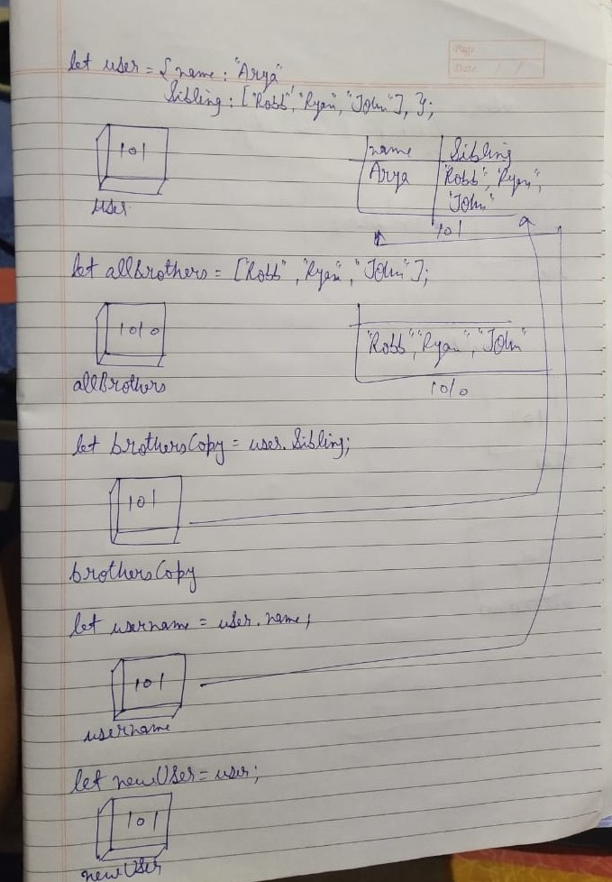

```js
let user = {
  name: "Arya",
  sibling: ["Robb", "Ryan", "John"],
};
let allBrothers = ["Robb", "Ryan", "John"];
let brothersCopy = user.sibling;
let usename = user.name;
let newUser = user;
```

1. Memory representation

- Create the memory representation of the above snippet on notebook.
- Take a photo/screenshot and add it to the folder `code`

<!-- To add this image here use  -->

2. Answer the following with reason:

- `user == newUser;` // true // copy by Reference
- `user === newUser;`// true// copy by Reference
- `user.name === newUser.name;`// true // copy by Reference
- `user.name == newUser.name;`// true // copy by Reference
- `user.sibling == newUser.sibling;`// true // copy by Reference
- `user.sibling === newUser.sibling;`// true // copy by Reference
- `user.sibling == allBrothers;`// false // address not same
- `user.sibling === allBrothers;`// false // address not same
- `brothersCopy === allBrothers;`// false // address not same
- `brothersCopy == allBrothers;`// false // address not same
- `brothersCopy == user.sibling;`// true // copy by Reference
- `brothersCopy === user.sibling;`// true // copy by Reference
- `brothersCopy[0] === user.sibling[0];`// true // copy by Reference
- `brothersCopy[1] === user.sibling[1];`// true // copy by Reference
- `user.sibling[1] === newUser.sibling[1];`// true // copy by Reference
